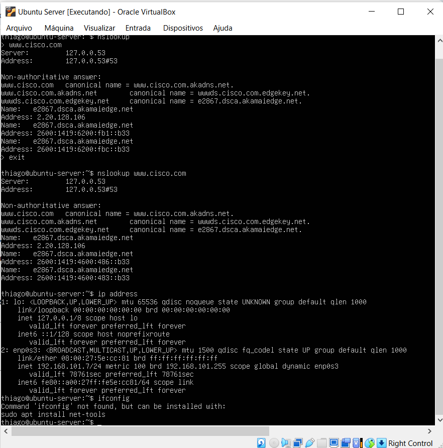
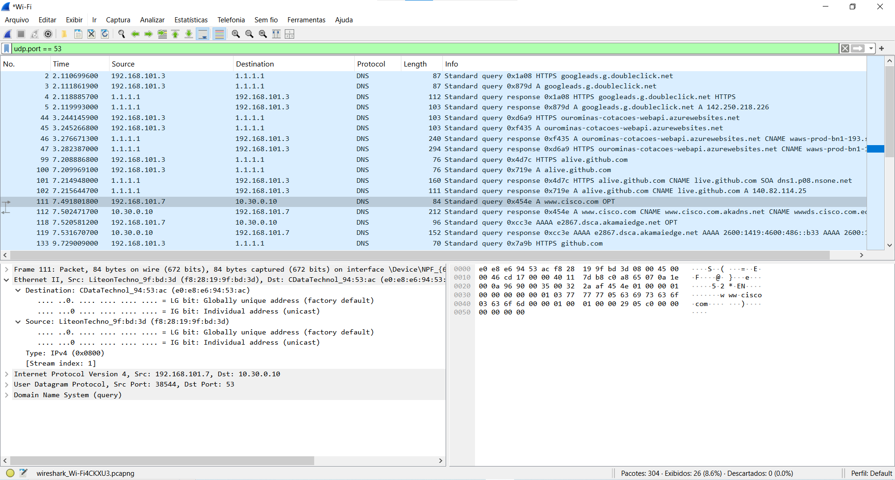
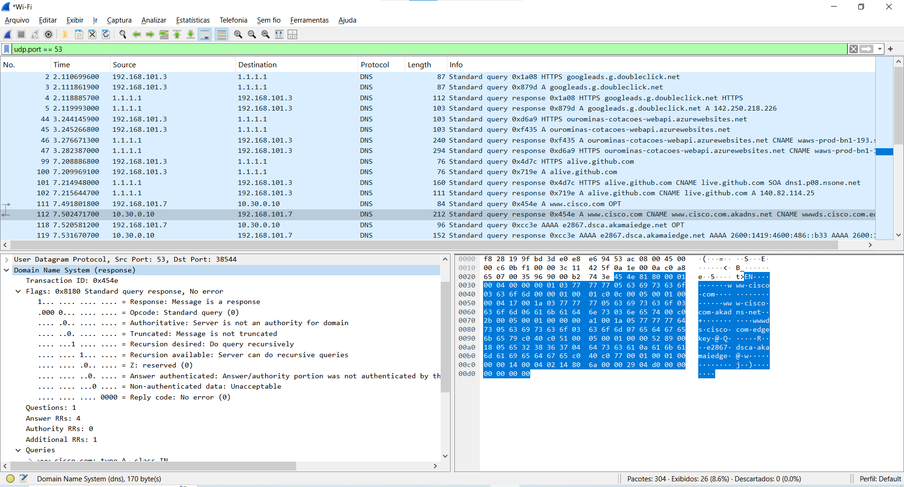

# 🔍 Análise de Tráfego DNS com Wireshark e Ubuntu Server

Este repositório contém o relatório prático de análise de tráfego de rede e resolução de nomes (DNS), integrando uma máquina virtual **Ubuntu Server** (configurada em modo *Bridge* via VirtualBox) ao **Wireshark** rodando no host.

---

## 🎯 Objetivos
- Executar comandos de gerenciamento de cache e resolução de nomes no Linux via CLI.
- Capturar e inspecionar pacotes DNS utilizando o Wireshark.
- Analisar os cabeçalhos Ethernet II, IPv4 e UDP, validando o mapeamento de endereços de origem e destino.
- Inspecionar as *Flags* do protocolo DNS para identificar suporte à consulta recursiva.

---

## 🛠️ Tecnologias e Ferramentas Utilizadas
- **Sistema Operacional Guest:** Ubuntu Server (Linux)
- **Virtualização:** Oracle VM VirtualBox (Rede em Modo *Bridge*)
- **Analisador de Pacotes:** Wireshark
- **Utilitários CLI:** `resolvectl`, `nslookup`, `ip address`

---

## 📋 Passo a Passo Executado

### 1. Limpeza de Cache e Consulta DNS no Linux
No terminal do Ubuntu Server, limpou-se o cache do resolvedor e foi feita a consulta direta ao domínio target:

```bash
# Limpeza do cache DNS
sudo resolvectl flush-caches

# Verificação do status do cache
sudo resolvectl statistics

# Consulta de resolução de nomes
nslookup [www.cisco.com](https://www.cisco.com)


---

## 📊 Análise dos Dados Capturados

### A. Pacote de Consulta (DNS Query - Frame 111)
- **MAC Origem:** `f8:28:19:9f:bd:3d` (Interface física do Host/VM)
- **MAC Destino:** `e0:e8:e6:94:53:ac` (Gateway Padrão / Roteador)
- **IP Origem:** `192.168.101.7` (VM Ubuntu Server)
- **IP Destino:** `10.30.0.10` (Servidor DNS)
- **Porta Origem:** `38544` (Porta dinâmica/efêmera)
- **Porta Destino:** `53` (Porta padrão do serviço DNS)

### B. Pacote de Resposta (DNS Response - Frame 112)
- Nos pacotes de resposta, observa-se a **inversão exata** dos pares de origem e destino:
  - **IP Origem:** `10.30.0.10` | **IP Destino:** `192.168.101.7`
  - **Porta Origem:** `53` | **Porta Destino:** `38544`
- **Análise de Flags:** O campo `Recursion available: Server can do recursive queries` foi identificado com bit de confirmação `1`, atestando que o servidor DNS suporta consultas recursivas.
- **Validação:** Os registros CNAME e A (`www.cisco.com.akadns.net`, `e2867.dsca.akamaiedge.net`) retornados no Wireshark coincidiram rigorosamente com a saída exibida pelo `nslookup` no terminal Linux.

---

## 📸 Evidências do Laboratório


*Figura 1: Execução do nslookup e verificação de IP/MAC no Ubuntu Server.*


*Figura 2: Inspeção do Frame de Consulta (Query) no Wireshark.*


*Figura 3: Inspeção do Frame de Resposta (Response) e Flags no Wireshark.*

---

## 🔒 Considerações de Segurança (Reflexão)

1. **Visibilidade de Rede:** Ao remover os filtros de captura, o Wireshark expõe todo o tráfego do segmento (como requisições ARP, ICMP, DHCP e pacotes HTTP/HTTPS), permitindo o mapeamento de ativos e topologia.
2. **Riscos de Segurança:** Um invasor com acesso ao meio físico ou em modo promíscuo pode utilizar técnicas de *sniffing* para interceptar dados não criptografados (credenciais, sessões). Para mitigar esses riscos, é indispensável o uso de protocolos seguros como **DoH (DNS over HTTPS)** e **DoT (DNS over TLS)**.
